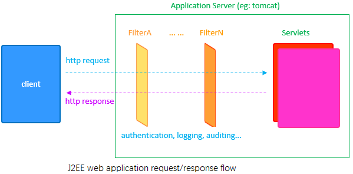
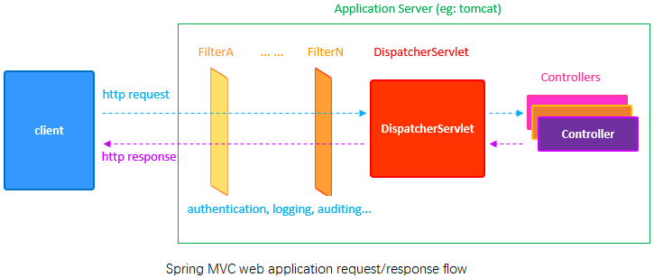

spring mvc是基于java EE Servlet API实现的。

### 1 Java EE Servlet
java EE Servlet运行于servlet container，比如tomcat。



通常HTTP请求会像通过一些filter，比如权限认证，登录等，如果通过了这些filter，那么，**application server**会把请求传递给已注册的处理该请求的**servlet**（通过URI patter匹配）。当servlet处理完请求，会生成一个HTTP响应，沿原路返回给**client**。

对于Java EE，每一个HTTP请求都会生成一个对应的**HttpServletRequest**，同样的，每一个HTTP响应也都会生成一个与之对应的**HttpServletResponse**。为了区分不同用户的请求，**application server**会在每个用户的第一个HTTP请求到来时为他创建一个**HttpSession**，每个HttpSession实例都有唯一的**session ID**, the session id will be sent to the client in the HTTP response headers as a cookie. client会保存该cookie并在下次请求时发回给服务端，这样服务器就能识别是哪个用户的请求了。

Java EE中，可以通过创建listener实现HttpSessionListener接口来监听**HttpSession**的生命周期；也可以通过实现ServletRequestListener接口来查看**HTTP请求**的生命周期。

要创建servlet需要派生javax.servlet.http.HttpServlet，并且使用@WebServlet或使用web.xml(这时Java EE web application的配置文件)来注册，然后要配置URI pattern来匹配http请求。而servlet内部，可以重写doGet/doPost/doPut/doDelete等方法实现业务逻辑。

### 2 Spring MVC
使用Spring MVC，就没有必要自己去创建servlet了。因为Spring使用**DispatcherServlet**来处理所有的HTTP请求，只需要创建Controller类并使用@Controller标注，然后使用@RequestMapping来映射URI pattern就可以了。



#### 2.1 最简单的Spring MVC web app
* 创建maven-archetype-quickstart项目
* POM中引入spring-boot-parent
继承Spring Boot's parent starter
```xml
<parent>
    <groupId>org.springframework.boot</groupId>
    <artifactId>spring-boot-starter-parent</artifactId>
    <version>2.1.3.RELEASE</version>
</parent>
```

* POM中添加spring-boot-starter-web依赖
spring-boot-starter-web包含spring-context
```xml
<dependency>
    <groupId>org.springframework.boot</groupId>
    <artifactId>spring-boot-starter-web</artifactId>
</dependency>
```

* App标注@SpringBootApplication
@SpringBootApplication spring会进行自动配置
```java
//会启动spring container
SpringApplication.run(App.class, args);
```


* 创建Controller
```java
@Controller
@RequestMapping("/home")
public class HomeController{

    @GetMapping("/hello")
    @ResponseBody
    public String hello(){
        //返回一个简单的字符串，它会由HttpServletResponse返回给client
        //默认情况，返回字符串会被当做资源请求路径，这里为/hello, spring mvc!，
        //所有我们增加了@ResponseBody来标注返回的字符串为http reponse body
        return "hello, spring mvc!";
    }
}
```
* @Controller标注HomeController类为spring mvc controller类
* @RequestMapping指定满足该URL pattern的请求由该controller处理
* @GetMapping("/hello")等价于@RequestMapping(value="/hello", method = RequestMethod.GET)
* @ResponseBody标注返回的是http reponse body；没有该标注时，返回字符串会被当做资源请求路径。
* @RestController等价于@Controller和@ResponseBody的组合


* 运行mvn spring-boot:run
POM添加编译插件
```xml
<build>
  <finalName>hello</finalName>
  <plugins>
    <plugin>
      <groupId>org.springframework.boot</groupId>
      <artifactId>spring-boot-maven-plugin</artifactId>
    </plugin>
  </plugins>
</build>
```

```
mvn spring-boot:run
```

* 查看运行结果
http://localhost:8080/home/hello


#### 2.2 符合mvc pattern's 的例子
* POM中增加template engine依赖, spring-boot会自动帮我们完成配置
```xml
<dependency>
  <groupId>org.springframework.boot</groupId>
  <artifactId>spring-boot-starter-thymeleaf</artifactId>
</dependency>
```
* thymeleaf模板引擎默认查找路径为/src/main/resources/templates

#### 2.3 filter(chain of responsibility)
创建filter可以通过实现 javax.servlet.Filter接口，或者从 org.springframework.web.filter.GenericFilterBean派生。
注册filter，两种方法：
* 1)通过增加```<filter>``` 和 ```<filter-mapping>``` 到 web.xml 文件；
* 2)通过配置类