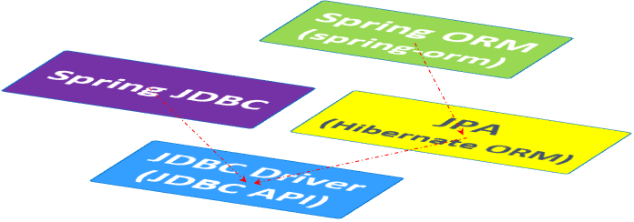

Spring-jdbc-jpa

## 1. 基本概念
* **JDBC**(Java database Connectivity)
  **JDBC API**定义如何访问关系型数据库中的数据。
  **JDBC driver**实现特定类型数据库的**JDBC API**。
  **Spring JDBC**是Spring提供的在JDBC API之上的一个抽象层，目的是为了简化和DB的交互。
* **JPA**(Java Persistence API)
  **JPA**定义了java对象持久化的标准方法，使用**ORM**(object-relational mapping)机制弥合面向对象模型与存储在关系数据库中的数据之间的差距。
  **Hibernate ORM**就是一种比较流行的JPA标准的实现。

* JDBC and JPA are two sets of APIs for solving different issues. 
JDBC API solves interaction with the database, while JPA solves storing/retrieving of objects to/from databases in an object-oriented way. Underneath, JPA implementations rely on JDBC drivers to access databases.

## 2. 使用JDBC driver

* 创建项目

* 添加依赖
这里我们为了使用spring jdbc提供的javax.sql.DataSource数据源装配，添加了spring jdbc依赖，但与DB的交互，我们使用的是jdbc driver(jdbc api)
 ```xml
    <!-- spring-context 依赖 -->
    <dependency>
      <groupId>org.springframework.boot</groupId>
      <artifactId>spring-boot-starter-web</artifactId>
    </dependency>
    <!-- spring jdbc位于jdbc driver之上, 提供对数据源的装配(javax.sql.DataSource)，提供一个JDBCTemplte简化使用，提供事务 -->
    <dependency>
      <groupId>org.springframework.boot</groupId>
      <artifactId>spring-boot-starter-jdbc</artifactId>
    </dependency>
    <!-- jdbc driver实现特定数据库的JDBC API，这里为mysql jdbc driver实现mysql数据库的JDBC API -->
    <dependency>
      <groupId>mysql</groupId>
      <artifactId>mysql-connector-java</artifactId>
    </dependency>
 ```
* 添加DB操作类
Message
MessageRepository只用JDBC API操作DB
MessageService

* 添加Controller和参数MessageData

* 添加DB配置application.properties
```
spring.datasource.url=jdbc:mysql://localhost:3306/app_messages?useUnicode=true&characterEncoding=utf8&serverTimezone=GMT%2B8
spring.datasource.username=root
spring.datasource.password=MySql-2019
spring.datasource.driver-class-name=com.mysql.cj.jdbc.Driver
```

## 3. 使用Spring JDBC
步骤和上面的一样，但MessageRepository不用JDBC API操作DB，而是用Spring JDBC提供的NamedParameterJdbcTemplate操作。

## 4. 使用Hibernate
#### 步骤与上面一样，但依赖除了上面的，还需要spring-orm和hibernate
```xml
    <!-- spring ORM 提供ORM支持，依赖于具体的ORM框架，比如hibernate -->
    <dependency>
      <groupId>org.springframework</groupId>
      <artifactId>spring-orm</artifactId>
    </dependency>

    <!-- hibernate -->
    <dependency>
      <groupId>org.hibernate</groupId>
      <artifactId>hibernate-core</artifactId>
    </dependency>
```

#### 数据库表和java类映射

 * DDL：Data Definition Language
 * metadata指定类与表如何映射
 * hibernate Entity类需要有默认构造函数
 * @javax.persistence.Entity标记该类为Entity类
 * @javax.persistence.Table标记类映射的DB表
 * @javax.persistence.Id标记entity的主键
 * @javax.persistence.GeneratedValue标记值如何生成，strategy = GenerationType.IDENTITY标识由DB为我们生成，这和DB表中该字段定义为AUTO_INCREMENT是匹配的。
 * @javax.persistence.Column标记该field映射的column, nullable=false标记column不为空，length指定column数据长度
 * @javax.persistence.Temporal当field的类型为java.util.Date 或 java.util.Calendar类型时需要，
 TemporalType.TIMESTAMP表示createdDate field映射为JDBC driver能理解的java.sql.Timestamp类型
 * Hibernate won't perform a data validation based on the nullable setting and the length attribute of the @Column annotation.

 #### DataSource注入到SessionFactory
 org.hibernate.Session是操作DB的主要接口，它可以通过 Hibernate SessionFactory创建，而spring提供了LocalSessionFactoryBean来创建SessionFactory

 ```java
@Configuration
@ComponentScan("basic.com")
public class AppConfig{
    //创建LocalSessionFactoryBean需要有javax.sql.DataSource
    private DataSource dataSource;

    //构造注入
    public AppConfig(DataSource dataSource) {
        this.dataSource = dataSource;
    }

    @Bean
    public LocalSessionFactoryBean sessionFactory() {
        LocalSessionFactoryBean sessionFactoryBean = new LocalSessionFactoryBean();
        sessionFactoryBean.setDataSource(dataSource);
        //指定扫描entity所在的包
        sessionFactoryBean.setPackagesToScan("basic.com");

        return sessionFactoryBean;
    }
}
 ```

 #### MessageRepository使用sessionFactory操作DB
 ```java
 @Component
public class MessageRepository{
    //注入SessionFactory
    private SessionFactory sessionFactory;

    public MessageRepository(SessionFactory sessionFactory){
        this.sessionFactory = sessionFactory;
    }

    public MessageEntity saveMessage(MessageEntity message){
        //通过SessionFactory获取session
        Session session = sessionFactory.openSession();
        session.save(message);
        return message;
    }
}
 ```
 